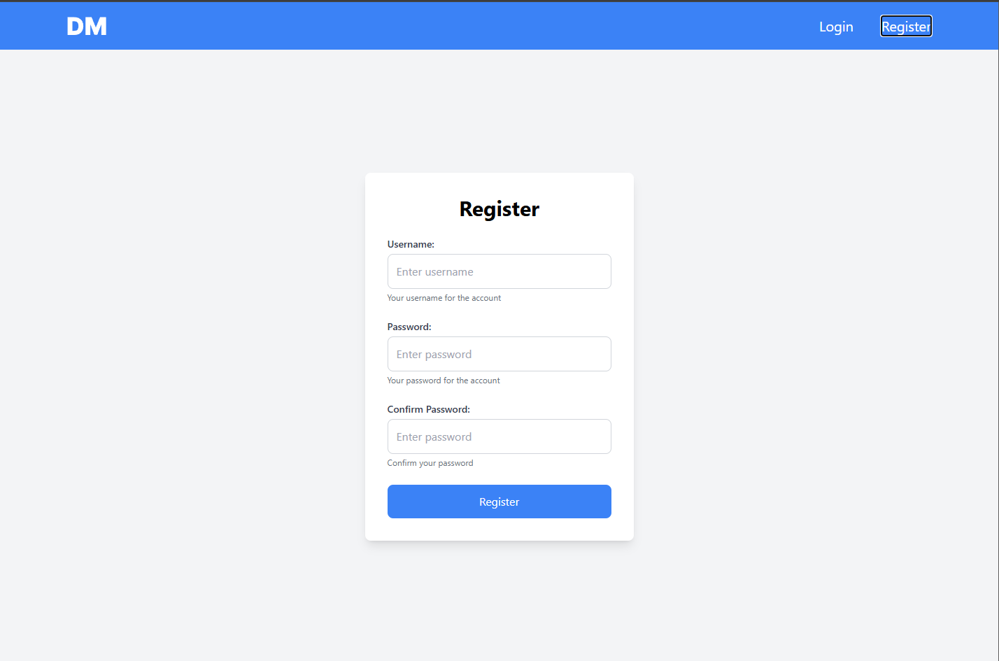
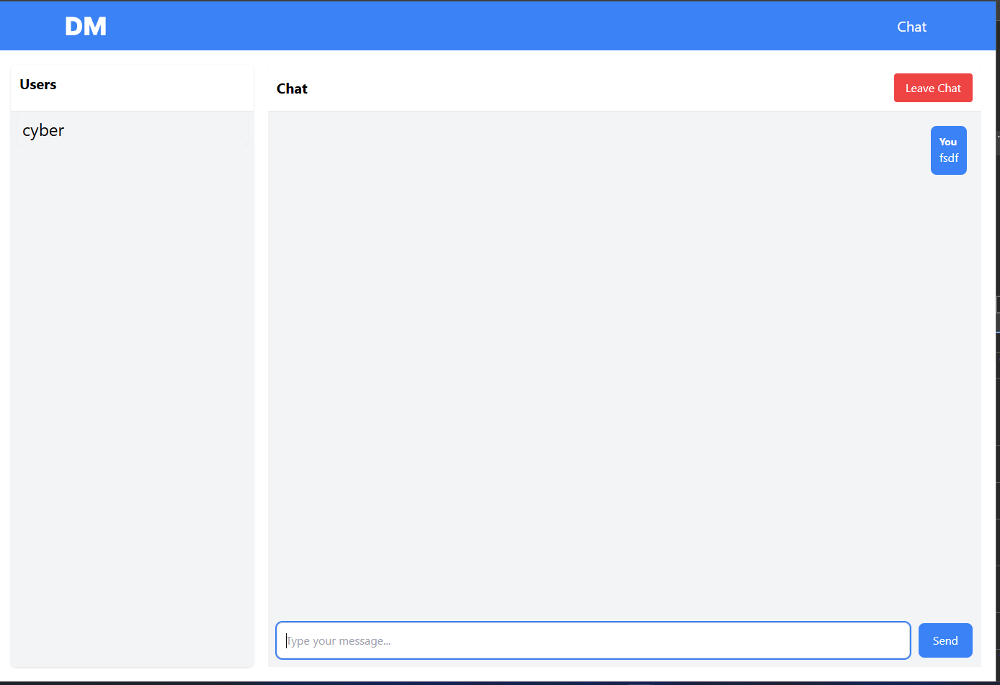

# Chat Application with JWT Authentication

A full-stack chat application built with **React** for the frontend and **Node.js** for the backend, featuring real-time communication via WebSockets and secure user authentication using JSON Web Tokens (JWT).

---

## Features

- **Real-Time Messaging**: Powered by WebSockets for instant communication.
- **Secure Authentication**: JWT-based login and token validation.
- **Modern UI**: Built with React for a seamless and responsive user experience.
- **Scalability**: Designed to handle multiple concurrent users.
- **Persistent Conversations**: Stores messages and user data in a database.

---

## Tech Stack

### Backend
- **Node.js** with **Express**: Handles server-side logic and API endpoints.
- **WebSockets**: Enables real-time communication.
- **JWT**: Provides secure user authentication.
- **Database**: SQLite

### Frontend
- **React**: A modern JavaScript library for building user interfaces.
- **Styling**: Tailwindcss

---

### Login Page

### Register Page

### Chat Page

